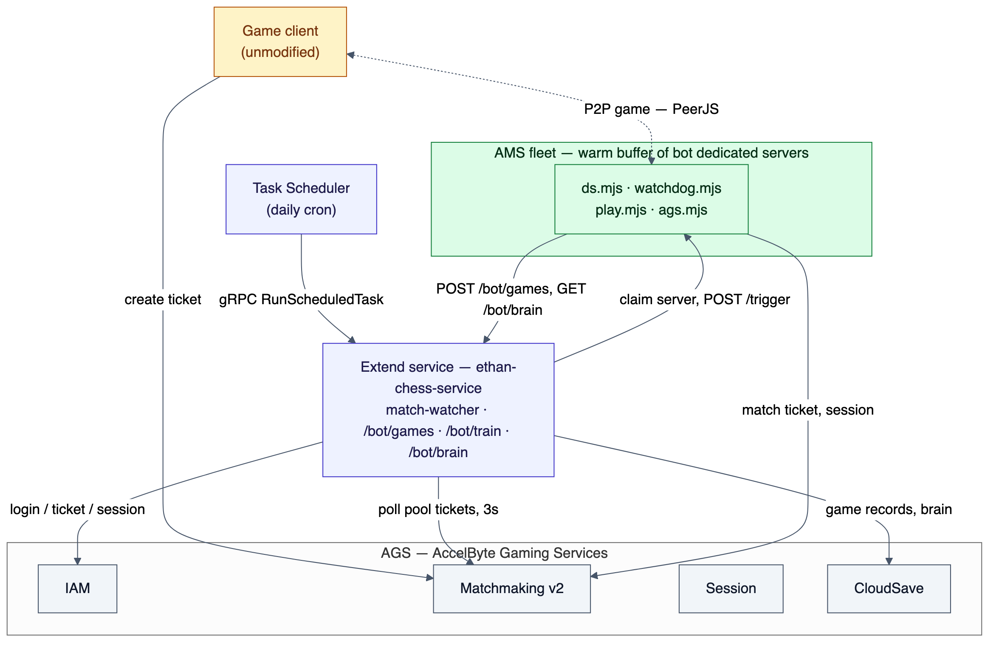
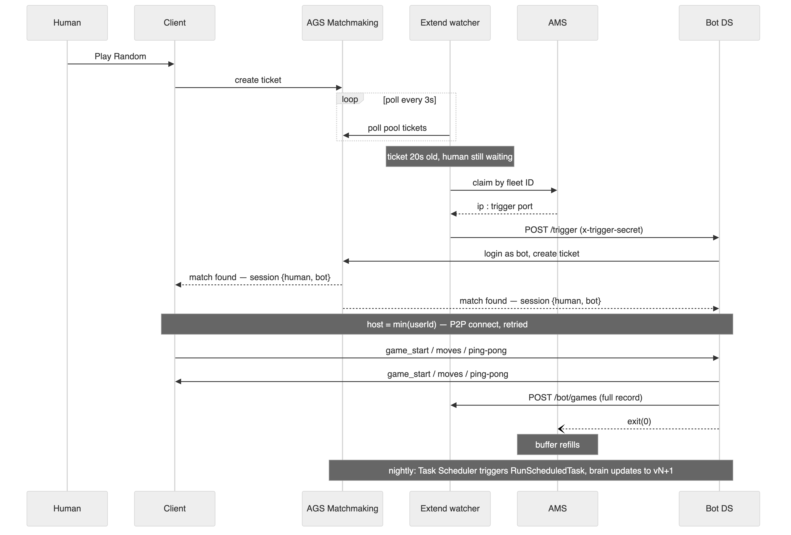

# How a Self-Training AI Bot Solves Matchmaking Cold Start Without Touching the Game Client

*By Junaili Lie*

A player taps "Play Online," waits 30 seconds, sees nobody, and closes the app.
On a game with low concurrent players, that's not an edge case. It's most
sessions. No players means no matches, which means no players. We solved it
for [Ethan's Chess](https://github.com/junaili/chess) with a bot that queues
as a real account, gets matched by real matchmaking, and trains itself
nightly on its own games. This post is the architecture, with the code.

The constraint that made this hard: **zero changes to the game client.** No
"if no match found, spawn local bot" fallback. The client stays completely
unaware that bots exist, because that logic branch is exactly the kind of
code path a curious player finds in five minutes.

## Design principles before code

Three rules shaped every decision below. The bot enters the queue only after
a human has waited past a threshold (20 seconds here); it never takes a
match two humans could have had. It's a real player: real IAM account, real
password-grant login, real matchmaking ticket, paired by AGS exactly like it
would pair any human. And compute is ephemeral: one dedicated server plays
exactly one game, reports the result, and exits. There's no long-lived bot
process to leak state or wedge — a crashed instance is just "the next one."

Everything downstream, from where the gate lives to how learning is stored,
follows from those three.

## System overview



*Figure 1. Four moving pieces: the game client (untouched), an Extend service
that gates and orchestrates, an AMS fleet of ephemeral bot servers, and a
nightly training job feeding back into the same Extend service.*

Extend polls the match pool every 3 seconds with an admin token. When a
human ticket is 20+ seconds old, it resolves the bot fleet, claims a
dedicated server from AMS, and POSTs `/trigger`. That server logs in as the
bot account, creates a match ticket, and AGS matchmaking pairs it with the
waiting human, the same path a second human would take. The two sides
connect over the game's own P2P transport. When the game ends, the bot POSTs
the full move record back to Extend for that night's training run and
exits; AMS launches a fresh replacement into the buffer.

We've written before about [fixing matchmaking without client-side
changes](https://accelbyte.io/blog/smarter-matchmaking-for-online-games-solving-region-fragmentation-without-client-side-change)
for region fragmentation. Cold start is a different failure mode under the
same constraint: the fix has to live entirely on the backend.

## The 20-second gate

The gate is a goroutine inside an [Extend Service
Extension](https://accelbyte.io/blog/all-about-extend) app, no new
deployable, just `go w.Start(ctx)` from `cmd/main.go`. It polls
[`GET /match2/v1/namespaces/{ns}/match-pools/{pool}/tickets`](https://github.com/junaili/chess/blob/main/custom-extend-app/ethan-chess-service/pkg/handler/matchwatcher.go)
with the service's client-credentials token and looks for tickets older than
`BOT_WAIT_SECONDS`:

```go
// pkg/handler/matchwatcher.go
if now.Sub(created) >= time.Duration(w.waitSeconds)*time.Second {
    // Re-trigger a still-waiting human after a cooldown, in case the bot's
    // first ticket lost the race to pair with them (they'd otherwise be
    // stuck). A spurious re-trigger is harmless: the bot's ticket self-
    // cancels at 10s when there's no one to match.
    last, seen := w.triggered[id]
    if !seen || now.Sub(last) >= time.Duration(w.retriggerSeconds)*time.Second {
        w.trigger()
        w.triggered[id] = now
    }
}
```

Two things bit us building this that are worth naming up front.

The pool ticket JSON is PascalCase and nested, not the flat shape the public
API docs imply: the owning player lives at `Ticket.Players[].PlayerID`. Go's
`json.Unmarshal` is case-insensitive so the flat fields resolve fine, but the
nested `Ticket` needs its own struct. We now log the first raw response on
every new integration point; it turns a guessing exercise into a five-minute
fix.

The watcher can also feed on its own bot. Without an owner check, the bot's
own ticket ages past 20 seconds and the watcher triggers another bot against
it, a bot-vs-bot loop. Fixed at two layers: `isBotTicket()` compares against
`BOT_USER_ID`, and, belt and suspenders, the bot's own ticket self-cancels
after 10 unmatched seconds, so even a missed owner check can't compound.

## Claiming a real server from AMS

The bot needs compute to run on, a [dedicated
server](https://accelbyte.io/blog/the-role-of-authoritative-dedicated-servers-in-live-game-development)
that logs in, plays, and disappears. We use [AccelByte Multiplayer
Servers](https://accelbyte.io/blog/announcing-the-independent-availability-of-accelbyte-multiplayer-servers)
(AMS) with a warm buffer, claimed on demand:

```go
// pkg/handler/matchwatcher.go — claim by fleet ID, region required
reqURL = fmt.Sprintf("%s/ams/v1/namespaces/%s/fleets/%s/claim", amsBase, namespace, fleetID)
reqBody = map[string]any{"region": w.amsRegion, "sessionId": sessionID}
```

Fleet IDs change on every image rollout, so the watcher never hardcodes one.
It lists fleets, fetches each fleet's detail (the list endpoint alone
doesn't carry claim keys), and matches an active fleet whose `claimKeys`
contain the configured key. That resolution is cached 5 minutes and
invalidated on any claim 404:

```go
// pkg/handler/matchwatcher.go
func (w *MatchWatcher) fleetIDForClaim(amsBase, namespace, token string) (string, error) {
    if id, at := w.getResolvedFleet(); id != "" && time.Since(at) < 5*time.Minute {
        return id, nil
    }
    // list fleets → fetch detail per fleet → match claimKeys → cache
    ...
}
```

We initially tried `PUT /servers/claim` with a list of claim keys directly,
the documented shortcut. In our environment it returned "no matching DS
available" persistently against a ready, correctly-keyed server, while
claim-by-fleet-ID worked every time. Resolve-then-claim-by-ID gets the
ergonomics of a stable key with the reliability of an ID. If your
environment claims cleanly by keys, skip the resolution step, but log the
first raw claim response regardless; the response shape isn't obvious
upfront.

The claimed server answers on a **named TCP port** injected via a fleet
command-line placeholder:

```
-dsid=${dsid} -port=${default_port} -trigger_port=${trigger_port}
```

The fleet's auto-created `default` port is UDP and immutable. The HTTP
trigger needs its own named TCP port. AMS assigns the actual port number
per launch, so the DS binds whatever it's handed, never a fixed value.

## Playing a game nobody can tell is a bot

`ds.mjs` is the AMS entrypoint. It reuses the proven login/ticket/session
pieces unchanged and adds exactly one lifecycle: one claim, one game, drain.

```js
// peerjs-bot-spike/ds.mjs
async function onTrigger(wd) {
  if (busy) return
  busy = true
  fetchBrain().then((b) => { tuning = b }).catch(() => {}) // parallel with login
  await ensureLogin()
  await runOneGame()
  ...
  shutdown(wd, code)
}
```

Two design details do most of the "indistinguishable from human" work.

Ethan's Chess connects players over [PeerJS](https://peerjs.com/) (WebRTC
data channels), and the session host is the lexicographically smallest
userId, the client's own convention, mirrored here. The joiner never needs a
discoverable peer ID since nobody dials it, so as joiner the bot registers a
random ID. As host it must register the userId-derived ID the human joiner
will compute and dial, and register it fast: the human dials exactly once,
roughly 2.2 seconds after learning of the match.

```js
// peerjs-bot-spike/ds.mjs
// JOINER: a random peer id — nobody dials the bot, and this is what allows
// several bot instances on one account to play concurrently.
peer = await registerPeer(undefined)
```

That asymmetry is also what lets one bot account run multiple concurrent
games as joiner without ID collisions; only the host role is exclusive.

The bot also polls its own match ticket every 500ms and cancels it after 10
seconds unmatched. A genuinely waiting human matches within one or two
polls, so an unmatched bot ticket means a spurious trigger. Canceling it
stops the ticket from ever aging past the watcher's 20-second gate, closing
the bot-vs-bot loop mentioned earlier at its source, not just at the
trigger side.

For move legality, the bot doesn't reimplement chess rules. `engine.mjs`
loads the game client's own `chess-engine.js` / `ai-engine.js` into Node
with `vm.runInThisContext`: same code, same legality, zero drift between
what the client accepts and what the bot plays.

## The self-learning loop: an AI personality, not a difficulty slider

This is the part that turns "a bot" into "Gambit Gus." Every finished game
gets POSTed back to Extend:

```go
// pkg/handler/botgames.go
func BotGamesHandler(secret, botID string) http.HandlerFunc {
    // stores botbrain.MatchEntry: id, opponent, result from the bot's
    // perspective, timestamps, the full coordinate move list — capped at
    // 500 games, deduped by id, in a CloudSave admin record
```

A daily job, invoked over gRPC by the [AGS Extend Task
Scheduler](https://docs.accelbyte.io/gaming-services/modules/foundations/extend/data-and-messaging/extend-task-scheduler/)
(`ScheduledTaskHandler.RunScheduledTask`, cron configured in the Admin
Portal with no URL since routing is implicit), replays the last 24 hours of
games and splits learning into two tracks that never depend on each other.

Deterministic tuning always runs, no LLM required:

```go
// pkg/trainer/tuning.go
switch {
case t.WinRate > winRateHigh && idx > 0:
    idx--
case t.WinRate < winRateLow && idx < len(difficultyLadder)-1:
    idx++
}
t.Difficulty = difficultyLadder[idx]
```

Difficulty nudges one step per day toward a ~50% trailing win rate. Think
time is re-derived from the observed pace of real games (`duration /
plies`, clamped 700-2,600ms), so the bot's pacing comes from its own play,
not a config constant. The opening book keeps the top 12 lines by weighted
score from games that actually won or drew.

LLM reflection is the personality layer, and it's explicitly optional:

```go
// pkg/trainer/reflect.go — BuildPrompt
system = fmt.Sprintf(`You are %s, a chess bot that learns ONLY from your own games.
You keep a private training journal. Below is your personality and your style settings.

--- PERSONA ---
%s

--- STYLE (style.json) ---
%s

Be concise, concrete, and honest about your mistakes. Keep your attacking soul,
but learn what actually works. Never invent games or facts beyond what you are shown.`,
    bot.ID, strings.TrimSpace(bot.Persona), strings.TrimSpace(string(bot.Style)))
```

The persona is a plain text file baked into the bot's image: tone, playing
philosophy, voice. Every day, the model gets that persona, the bot's
existing lessons ("do not repeat these"), and the day's games as PGN, and
returns strict JSON — a journal entry in the bot's own voice, new tagged
lessons, and per-opponent notes. `reflect.go`'s `Apply()` merges that with
the deterministic opening/opponent tallies, versions the brain, and caps the
lesson list at 200 entries (lowest-weight, oldest-first eviction) so it
stays sharp rather than growing without bound.

The provider is swappable by environment variable, not code:

```go
// pkg/llm/llm.go
type Provider interface {
    Name() string
    Model() string
    Complete(ctx context.Context, req Request) (string, error)
}
```

`LLM_PROVIDER=anthropic|openai`, with `LLM_BASE_URL` pointing `openai` mode
at any OpenAI-compatible local server (Ollama, vLLM, LM Studio). If the LLM
call fails or the key is unset, `RunTraining` logs it and keeps going;
deterministic tuning still lands, only the journal and lessons are skipped
for that run. Self-learning that depends on an external API being up around
the clock would be a worse system than one with no learning at all.



*Figure 2. End-to-end timeline: roughly 20s gate plus 2s claim, 2s
trigger/login/queue, 2s match, and 3s connect. About 30 seconds from
queueing to playing what feels like a person.*

## What actually broke, field by field

Every mitigation below shipped after the failure happened once in a real
environment, not from a design review.

| Failure | Fix |
|---|---|
| Watcher triggers on the bot's own ticket | Owner check on `Ticket.Players[].PlayerID`, plus a 10s self-cancel: two independent breaks in the same loop |
| Fleet ID churns on every rollout | Resolve fleet by claim key at runtime; invalidate the cache on any 404 |
| Trigger POST lost after a successful claim | Retry the POST 4×; DS self-recycles after 60 min idle regardless |
| Node/native-addon glibc mismatch on the AMS host | `StartError -999` with zero logs, fixed by shipping a glibc-217 Node build and deferring the native WebRTC import so a load failure logs instead of crashing pre-boot |
| Watchdog protocol mismatch | `CreationTimeout` on an otherwise healthy process, fixed by sending the `ams-dsid` header and repeating the dsid inside the ready payload; iterated against the local AMS Simulator instead of shipping cloud guesses |
| Same bot account claimed twice | Second peer registration collides (`unavailable-id`); role-based peer IDs plus the 30s retrigger absorb it for now, but an account pool is the real fix at higher concurrency |

The AMS host detail is worth a beat. Our bundled `@roamhq/wrtc` needed
glibc 2.34, the official Node binary needed 2.28, and a version mismatch on
either killed the process before it logged anything, reported by AMS as
`StartError exit code -999` with no stdout. We fixed it by shipping [Node's
unofficial glibc-217
build](https://github.com/junaili/chess/blob/main/peerjs-bot-spike/build-bundle.sh)
so startup is host-independent, and deferring the risky native import so any
remaining incompatibility is a logged event instead of a silent crash. One
`GET {basePath}/debug/watcher?key=...` endpoint exposing the watcher's last
poll, claim, and trigger result turned every one of these from a production
mystery into a five-minute diagnosis. Build the equivalent for your service
on day one.

## What ports to a different game

The cold-start machinery, meaning the gate, fleet resolution,
claim-and-trigger, the watchdog lifecycle, the training frame, and the
`/debug` pattern, is game-agnostic and reuses close to verbatim. Three
pieces are specific to Ethan's Chess and need replacing per game: the
transport layer (`play.mjs`, swap PeerJS for whatever the client actually
uses, or shrink this layer entirely if it's already server-authoritative);
the rules engine (`engine.mjs`, load your own client's rules/AI code the
same way so legality agreement is guaranteed for free); and what "replay"
and "learn" mean for your game (`pkg/chessreplay` and `tuning.go`'s
internals are chess-specific, but win-rate calibration and pace-matching as
a pattern transfer directly).

The invariants that shouldn't change regardless of game: gate in the
backend, bot as a real player through real matchmaking, one ephemeral
server per game, a timeout at every layer, and deterministic learning that
never depends on the LLM being reachable.

Full architecture reference, permissions list, and porting checklist live
in [`docs/ai-bot-cold-start-architecture.md`](https://github.com/junaili/chess/blob/main/docs/ai-bot-cold-start-architecture.md).
If you're building something similar on Extend and AMS, the [AccelByte
Discord](https://accelbyte.io/blog/introducing-the-accelbyte-developer-community-discord)
is the fastest way to compare notes.
